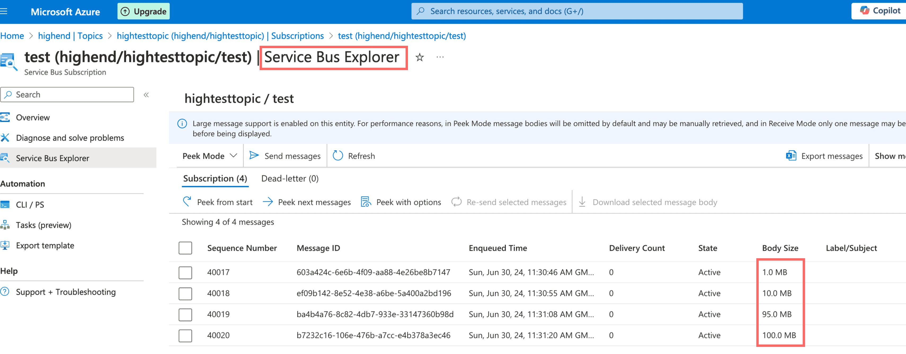
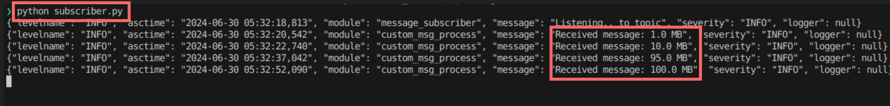

# Azure Service Bus Publisher and Subscriber

This project demonstrates how to use Azure Service Bus to `publish` and `subscribe` the messages using two different method:
-  `connection_string_based`
-   `passwordless authentication`.

Azure Service Bus offers three `pricing tiers`. For this project, the `Premium` tier was selected due to its support for a maximum message size of `100MB`.
- Different message size was published & subscribed `[1MB, 10MB, 95MB, 100MB]`

### Azure Portal Service Bus - Message Published to a Topic


### Terminal View - Message Subscribed



## Getting Started

### Prerequisites

- Python `3.8` or higher
- `pip` (Python package installer)
- An `Azure account` with an active subscription

### Installation 
 `Clone` the repository:

```bash
git clone https://github.com/Mazhar004/azure-service-bus-pub-sub.git
```

### Configuration
Create a `.env` file in the root of your project & insert your secrets. Here's an example:
```env
FULLY_QUALIFIED_NAMESPACE=YOUR_SERVICE_BUS_NAME.servicebus.windows.net

# Required Connection String Based Configuration
CONNECTION_STR=

# Required for Password Less Configuration
AZURE_CLIENT_ID=
AZURE_CLIENT_SECRET=
AZURE_TENANT_ID=

# Required for Publisher & Subscriber
TOPIC_NAME=

# Required for Subscriber Only
SUBSCRIPTION_NAME=
```

#### Virtual Environment Based Setup 
1. Create a `virtual` environment:
    ```bash
    python3 -m venv venv
    ```
2. Activate the `virtual` environment:
   - On `Unix` or `MacOS`:

        ```bash
        source venv/bin/activate
        ```
3. Upgrade `pip`:
    ```bash
    pip install --upgrade pip setuptools
    ```

4. `Install` the required packages:
    ```bash
    pip install -r requirements.txt
    ```
5. Install `Azure CLI`:

    For `Linux`:

    - Follow the guidline [Link](https://learn.microsoft.com/en-us/cli/azure/install-azure-cli-linux?pivots=apt)

    For `macOS`:

    ```bash
    brew update && brew install azure-cli
    ```

7. Login to `Azure`:

    ```bash
    az login
    ```

### Usage
#### Publisher
To publish a message, run the following command:
```bash
python publisher.py --msg "Your message here" --pubsub
```

#### Subscriber
To start the subscriber, run the following command:
```bash
python subscriber.py
```

### To RUN with Docker
### Configuration
- Create a `.env` file in the root of your project & insert your secrets [Sample Configuration](#configuration)

### Build Image
```bash
docker build -t pubsubapp .
``` 
### Run Image
- Subcriber
    ```bash
    docker run pubsubapp python subscriber.py
    ```
- Publisher
    ```bash
    docker run pubsubapp python publisher.py --msg "your msg" --pubsub
    ```  

## License

This project is licensed under the terms of the [LICENSE](LICENSE) file.